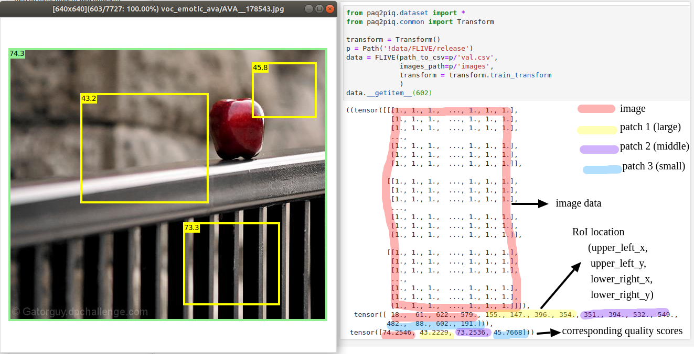

# PyTorch PaQ-2-PiQ: Patch Quality 2 Picture Quality Prediction

PyTorch implementation of [PaQ2PiQ](https://github.com/baidut/PaQ-2-PiQ)

## Demo

<a href="https://colab.research.google.com/github/baidut/paq2piq/blob/master/demo.ipynb" target="_parent"></a>

## Minimum code to test the pretrained model

no need to clone the repo, just run the following code

```python
import torch
import torch.nn as nn

import torchvision as tv
from torchvision import transforms
from torchvision.datasets.folder import default_loader
from torchvision.ops import RoIPool, RoIAlign

import numpy as np
from pathlib import Path
from PIL import Image

use_cuda = torch.cuda.is_available()
device = torch.device("cuda" if use_cuda else "cpu")

class AdaptiveConcatPool2d(nn.Module):
    def __init__(self, sz=None):
        super().__init__()
        sz = sz or (1,1)
        self.ap = nn.AdaptiveAvgPool2d(sz)
        self.mp = nn.AdaptiveMaxPool2d(sz)
    def forward(self, x): return torch.cat([self.mp(x), self.ap(x)], 1)

def get_idx(batch_size, n_output, device=None):
    idx = torch.arange(float(batch_size), dtype=torch.float, device=device).view(1, -1)
    idx = idx.repeat(n_output, 1, ).t()
    idx = idx.contiguous().view(-1, 1)
    return idx

def get_blockwise_rois(blk_size, img_size=None):
    if img_size is None: img_size = [1, 1]
    y = np.linspace(0, img_size[0], num=blk_size[0] + 1)
    x = np.linspace(0, img_size[1], num=blk_size[1] + 1)
    a = []
    for n in range(len(y) - 1):
        for m in range(len(x) - 1):
            a += [x[m], y[n], x[m + 1], y[n + 1]]
    return a

class RoIPoolModel(nn.Module):
    rois = None

    def __init__(self, backbone='resnet18'):
        super().__init__()
        if backbone is 'resnet18':
            model = tv.models.resnet18(pretrained=True)
            cut = -2
            spatial_scale = 1/32

        self.model_type = self.__class__.__name__
        self.body = nn.Sequential(*list(model.children())[:cut])
        self.head = nn.Sequential(
          AdaptiveConcatPool2d(),
          nn.Flatten(),
          nn.BatchNorm1d(1024, eps=1e-05, momentum=0.1, affine=True, track_running_stats=True),
          nn.Dropout(p=0.25, inplace=False),
          nn.Linear(in_features=1024, out_features=512, bias=True),
          nn.ReLU(inplace=True),
          nn.BatchNorm1d(512, eps=1e-05, momentum=0.1, affine=True, track_running_stats=True),
          nn.Dropout(p=0.5, inplace=False),
          nn.Linear(in_features=512, out_features=1, bias=True)
        )
        self.roi_pool = RoIPool((2,2), spatial_scale)

    def forward(self, x):
        # compatitble with fastai model
        if isinstance(x, list) or isinstance(x, tuple):
            im_data, self.rois = x
        else:
            im_data = x

        feats = self.body(im_data)
        batch_size = im_data.size(0)

        if self.rois is not None:
            rois_data = self.rois.view(-1, 4)
            n_output = int(rois_data.size(0) / batch_size)
            idx = get_idx(batch_size, n_output, im_data.device)
            indexed_rois = torch.cat((idx, rois_data), 1)
            feats = self.roi_pool(feats, indexed_rois)
        preds = self.head(feats)
        return preds.view(batch_size, -1)

    def input_block_rois(self, blk_size=(20, 20), img_size=(1, 1), batch_size=1, include_image=True, device=None):
        a = [0, 0, img_size[1], img_size[0]] if include_image else []
        a += get_blockwise_rois(blk_size, img_size)
        t = torch.tensor(a).float().to(device)
        self.rois = t.unsqueeze(0).repeat(batch_size, 1, 1).view(batch_size, -1).view(-1, 4)

class InferenceModel:
    blk_size = [20, 20]

    def __init__(self, model, path_to_model_state: Path):
        self.transform = transforms.ToTensor()
        model_state = torch.load(path_to_model_state, map_location=lambda storage, loc: storage)
        self.model = model
        self.model.load_state_dict(model_state["model"])
        self.model = self.model.to(device)
        self.model.eval()

    def predict_from_file(self, image_path: Path, render=False):
        image = default_loader(image_path)
        return self.predict(image)

    def predict_from_pil_image(self, image: Image):
        image = image.convert("RGB")
        return self.predict(image)

    @torch.no_grad()
    def predict(self, image):
        image = self.transform(image)
        image = image.unsqueeze_(0)
        image = image.to(device)
        self.model.input_block_rois(self.blk_size, [image.shape[-2], image.shape[-1]], device=device)
        t = self.model(image).data.cpu().numpy()[0]

        local_scores = np.reshape(t[1:], self.blk_size)
        global_score = t[0]
        return {"global_score": float(global_score), "local_scores": local_scores}

```

get predicts from a file:

```python
model = InferenceModel(RoIPoolModel(), 'models/RoIPoolModel.pth')
output = model.predict_from_file("images/Picture1.jpg")
```

or  predict from a PIL image:

```python
model = InferenceModel(RoIPoolModel(), 'models/RoIPoolModel.pth')
image = Image.open("images/Picture1.jpg")
output = model.predict_from_pil_image(image)
```

The output would be a dictionary:

```python
output['global_score'] # a float scale number indicating the predicted global quality
output['local_scores']  # a 20x20 numpy array indicating the predicted  local quality scores
```

## Installing

```bash
git clone https://github.com/baidut/paq2piq
cd paq2piq
virtualenv -p python3.6 env
source ./env/bin/activate
pip install -r requirements.txt
```


## Dataset

The model was trained on FLIVE. You can get it from [here](https://github.com/niu-haoran/FLIVE_Database/blob/master/database_prep.ipynb). (Feel free to create an issue [here](https://github.com/niu-haoran/FLIVE_Database/issues) if you encountered any problem)
For each image, we cropped three different-sized patches. The image data and patch location is taken as input while their scores as output. Here is an example:


## Model 

Used ResNet18 pretrained on ImageNet as backbone 

## Pre-trained model  

[Download](https://github.com/baidut/PaQ-2-PiQ/releases/download/v1.0/RoIPoolModel-fit.10.bs.120.pth) 

## Train it with Pytorch-lightning

```python
from pytorch_lightning_module import *
module = RoIPoolLightningModule()
trainer = pl.Trainer(gpus=[0])    
trainer.fit(module)
```

## Train it with Pure-Pytorch

Change the settings here:

```bash
export PYTHONPATH=.
export PATH_TO_MODEL=models/RoIPoolModel.pth
export PATH_TO_IMAGES=/storage/DATA/images/
export PATH_TO_CSV=/storage/DATA/FLIVE/
export BATCH_SIZE=16
export NUM_WORKERS=2
export NUM_EPOCH=50
export INIT_LR=0.0001
export EXPERIMENT_DIR_NAME=/storage/experiment_n0001
```
Train model
```bash
python cli.py train_model --path_to_save_csv $PATH_TO_CSV \
                                --path_to_images $PATH_TO_IMAGES \
                                --batch_size $BATCH_SIZE \
                                --num_workers $NUM_WORKERS \
                                --num_epoch $NUM_EPOCH \
                                --init_lr $INIT_LR \
                                --experiment_dir_name $EXPERIMENT_DIR_NAME
```
Use tensorboard to tracking training progress

```bash
tensorboard --logdir .
```
Validate model on val and test datasets
```bash
python cli.py validate_model --path_to_model_state $PATH_TO_MODEL \
                                    --path_to_save_csv $PATH_TO_CSV \
                                    --path_to_images $PATH_TO_IMAGES \
                                    --batch_size $BATCH_SIZE \
                                    --num_workers $NUM_EPOCH
```
Get scores for one image
```bash
python cli.py get-image-score --path_to_model_state $PATH_TO_MODEL \
--path_to_image test_image.jpg
```

## Contributing

Contributing are welcome

## Acknowledgments

* [PyTorch NIMA: Neural IMage Assessment](https://github.com/truskovskiyk/nima.pytorch)
* https://github.com/vdouet/Discriminative-learning-rates-PyTorch

